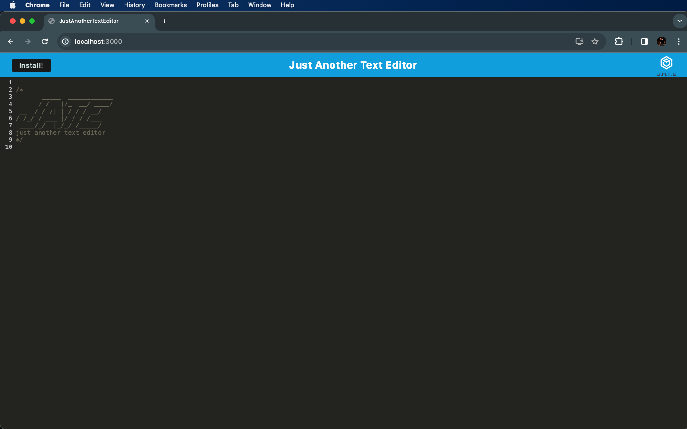
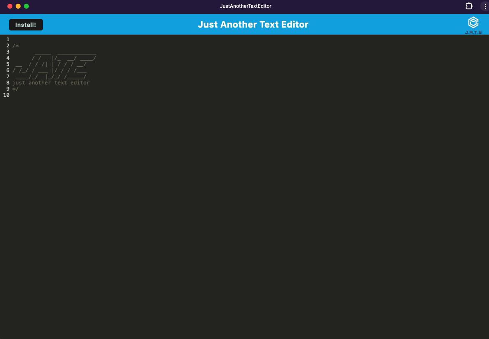

# Just Another Text Editor

## Description
A text editor that satisfies as a progressive web application, meaning it contains a service worker, a manifest, can be used offline, and is installable and usable locally.

### Installation
 - Fork this [repository](https://github.com/morgs999/Text-Editor)
 - In your terminal, navigate to the root folder of the local repository.
 - Run `npm install`.
 - Run `npm run build`.
 - Run `npm run start:dev`.
 - Open [localhost:3000](localhost:3000) in Google Chrome.
 - The app is now either now usable or installable.

### Usage
App In Use In Google Chrome

  
App Installed

  

#### Credits
Starter code provided by the University of Toronto Coding Boot Camp.

Libraries Used:
 - [Babel](https://github.com/babel/babel)
 - [Webpack](https://www.npmjs.com/package/webpack)
 - [Express](https://expressjs.com)
 - [idb](https://www.npmjs.com/package/idb)

#### License
No License provided.